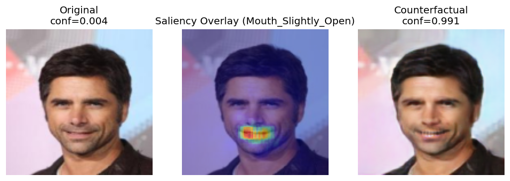
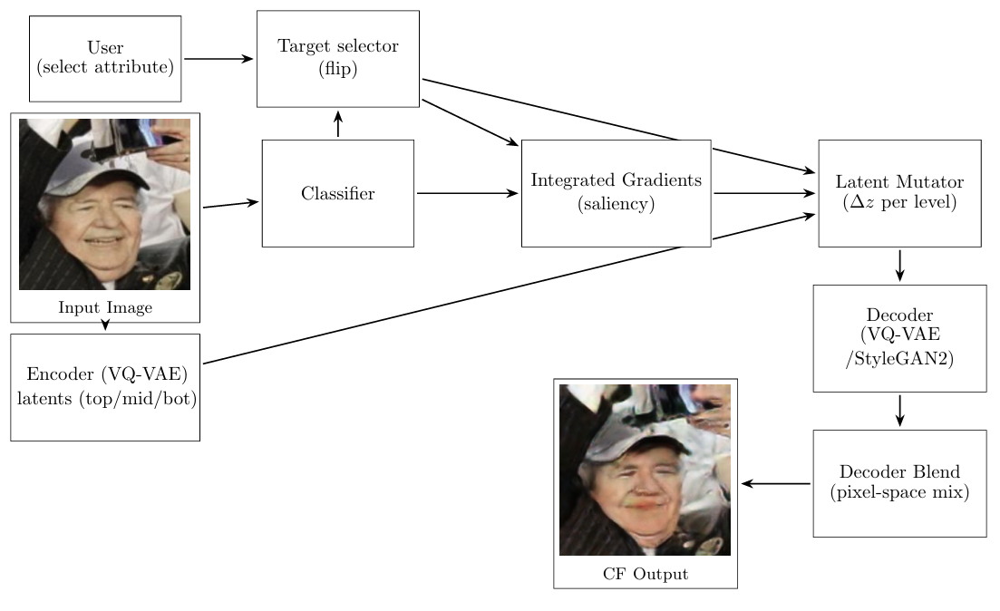
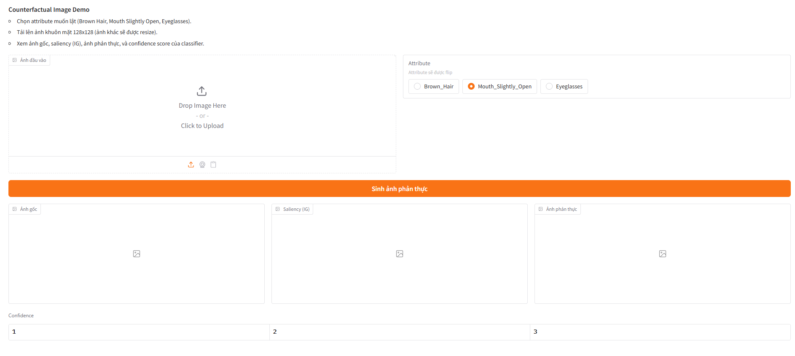

# Counterfactual Explanation for Attribute Classifiers (StyleGAN-like Decoder)

This repository generates **counterfactual images** for a multi-attribute face classifier (CelebA subset). The goal is to flip one selected attribute (e.g., *Mouth Slightly Open*, *Eyeglasses*) while keeping other content as stable as possible, and to visualize *where* the classifier’s evidence comes from via saliency.

If you only want to try inference quickly, start with the **GUI demo**: `gui_counterfactual.py`.

---

## Results (What to Expect)

The typical output is a 3-panel figure:

1. **Original image**
2. **Saliency overlay** (Integrated Gradients / sharpened saliency map)
3. **Counterfactual image** (the selected attribute is flipped)

<!-- NOTE (add images):
1) Add a “hero” collage (Original | Saliency | Counterfactual) for 2–3 attributes.
	 Suggested filenames:
	 - docs/results_mouth.png
	 - docs/results_eyeglasses.png
	 - docs/results_brown_hair.png
	 Use the same input identity so differences are obvious.
2) Add one “failure case” example (leakage or artifacts) to document limitations.
	 Suggested filename: docs/results_failure_case.png
-->



---

## Pipeline Overview

Pipeline workflow:



Key code locations:

- Classifier + explainability: `src/classifiers/`
- Counterfactual generator + training: `src/synthesis/`
- HR-VQVAE / latent stack: `src/unsupervised_latentspace/`

---

## Dataset Layout (CelebA)

The synthesis dataloader expects a CelebA-style root directory containing:

```
<DATA_ROOT>/
	img_align_celeba/
	list_attr_celeba.csv
	(optional) list_eval_partition.csv
```

---

## Quick Inference (Recommended)

### Option A: GUI Demo (Easiest)

Run:

```bash
python gui_counterfactual.py
```

What you get:

- Upload an image
- Choose an attribute to flip
- See: **Original / Saliency / Counterfactual** + a small table of classifier confidence deltas

Before running, verify these constants inside `gui_counterfactual.py` point to your checkpoints:

- `VQ_CHECKPOINT`
- `CLASSIFIER_CHECKPOINT`
- `DECODER_CHECKPOINT`
- `MUTATOR_TEMPLATE` (attribute-specific mutator checkpoint naming)

Dependencies:

- The GUI requires `gradio`.

<!-- NOTE (add image):
Add a screenshot of the GUI with a successful flip.
Suggested filename: docs/gui_screenshot.png
-->



### Option B: Single Image Script

Edit hard-coded paths at the top of `inference.py`, then run:

```bash
python inference.py
```

Outputs are written under `outputs/inference_single_image/`.

### Option C: Batch Inference

Edit the constants at the top of `inference_batch.py` (attribute name, checkpoint paths, dataset directory), then run:

```bash
python inference_batch.py
```

Outputs are written under `outputs/inference_batch/`.

---

## Training (If You Need to Reproduce Models)

Training is primarily driven from the notebook:

- `running_script.ipynb`

Typical order:

1. Train / load the HR-VQVAE (latent stack)
2. Train the attribute classifier (ResNet18 + CBAM)
3. Pre-train the decoder (reconstruction)
4. Train the counterfactual generator (mutator + decoder fine-tuning)

Checkpoints and logs are stored under `outputs/`, for example:

- `outputs/checkpoints_production/` (HVQ checkpoints)
- `outputs/cnn_classfier/` (classifier weights)
- `outputs/synth_network/stylegan_decoder/` (decoder weights)
- `outputs/synth_network/CF_generator/` (counterfactual training runs)

---

## Notes on “What is Saliency Overlay?”

In the visualizations, the saliency overlay typically uses a **smoothed, normalized saliency map** (often called `cam_soft`/`norm_map` in the code) rather than the raw IG map. This is why the overlay looks clean and localized.

---

## Repository Structure (Short)

```
src/
	classifiers/               # ResNet+CBAM + Integrated Gradients + Grad-CAM++
	synthesis/                 # Counterfactual generator, losses, training loop
	unsupervised_latentspace/  # HR-VQVAE / latent stack training

gui_counterfactual.py        # Gradio UI for interactive counterfactual inference
inference.py                 # Single-image counterfactual script
inference_batch.py           # Batch counterfactual script
running_script.ipynb         # End-to-end training notebook
outputs/                     # Checkpoints, logs, visualizations
```

---

## Troubleshooting

- **Dataset not found**: ensure `cfg.data_root` points to a folder containing `img_align_celeba/` and `list_attr_celeba.csv`.
- **GUI can’t find checkpoints**: update the 4 path constants at the top of `gui_counterfactual.py`.
